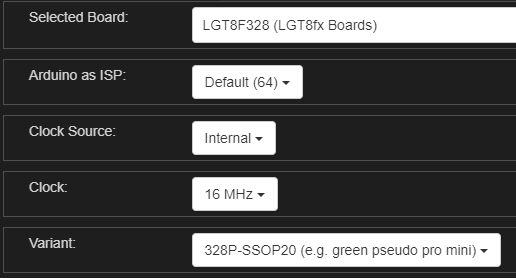

# MySensors Library readme for [lgt8fx](https://github.com/dbuezas/lgt8fx)

## Why start this
- Lgt8fx series is cheaper, faster, simpler and even has a SSOP20 version.
- According to the documents, lgt8fx is mostly compatible with avr, which makes it suitable for Mysensors with minor changes.

## Task status
- [x] Lgt8fx basic support(lgt8f328p-SSOP20)
- [ ] Low Power support
- [ ] Interrupt support

## Development Memo
Tested on:
- Hardware: lgt8f328p-SSOP20(e.g. green pseudo pro mini)
  - configuration
    - The clock must be set to 16MHz(default in bootloader). Not working in other clock setting by now.

    

- LGT8fx Boards by dbuezas Version 1.0.6

# Thanks
- [#LGT8fx Boards definition](https://github.com/dbuezas/LGT8fx) for the support of LGT8fx series.
- [#MySensors](https://github.com/mysensors/MySensors) for building the base.
- [#NodeManager](https://github.com/mysensors/NodeManager) for the fast development on mysensors gateways/nodes.
